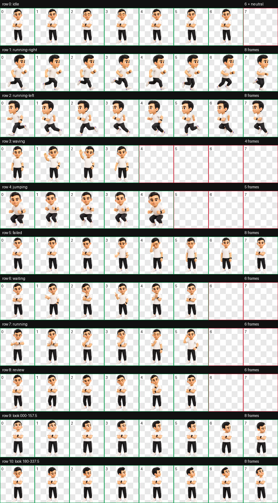

# Gus Orbit — Animated Pet



**Gus Orbit** is a custom animated companion for Codex Desktop: a friendly, tech-minded avatar with a clean white T-shirt, smartwatch, and a neon-purple orbit aesthetic. It was created as a personal portfolio piece by [Gustavo Paes de Liz](https://github.com/GustaPaes).

The sprite sheet follows the Codex v2 pet format: 11 animation rows, directional variants, transparent WebP artwork, and a matching `pet.json` manifest.

## Install in Codex Desktop (Windows)

Open PowerShell and run:

```powershell
git clone https://github.com/GustaPaes/gus-orbit-pet.git
cd gus-orbit-pet
PowerShell -ExecutionPolicy Bypass -File .\Install-GusOrbit.ps1
```

The installer copies the pet to your Codex pets folder and selects **Gus Orbit** as the default avatar. Restart Codex Desktop after the installation.

> `CODEX_HOME` is respected when it is set. Otherwise, the installer uses `%USERPROFILE%\.codex`.

### Without Git

Download this repository as a ZIP from GitHub, extract it, open PowerShell in the extracted folder, and run:

```powershell
PowerShell -ExecutionPolicy Bypass -File .\Install-GusOrbit.ps1
```

## Manual installation

Copy the complete [`pets/gus-orbit`](pets/gus-orbit) folder to your Codex pet directory:

| System | Target folder |
| --- | --- |
| Windows | `%USERPROFILE%\.codex\pets\gus-orbit` |
| macOS / Linux | `~/.codex/pets/gus-orbit` |
| Custom `CODEX_HOME` | `$CODEX_HOME/pets/gus-orbit` |

To select it manually, make sure your Codex configuration contains the following in its `[desktop]` section:

```toml
selected-avatar-id = "gus-orbit"
```

Then restart Codex Desktop.

## Other compatible tools

This package uses the Codex v2 pet structure. For another application that explicitly supports compatible custom pets, copy the `pets/gus-orbit` folder into that application's custom-pet location and select the ID `gus-orbit`. Check that tool's documentation for its exact destination and avatar-selection setting.

## Package layout

```text
assets/contact-sheet.png          # visual preview
pets/gus-orbit/pet.json           # Codex manifest
pets/gus-orbit/spritesheet.webp   # transparent animated sprite sheet
Install-GusOrbit.ps1              # Windows installer
install.sh                        # macOS/Linux asset installer
```

## Design notes

Gus Orbit turns a real-world personal look into a small, approachable digital companion. The visual direction balances professional confidence with playful motion: dark hair, a white tee, a black smartwatch, and a purple-blue space glow. The original reference photo is intentionally not included in this repository.

## License

Released under the [MIT License](LICENSE). The name, artwork, and portfolio presentation remain attributed to Gustavo Paes de Liz.
